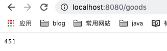

# DistributeLock

这个项目演示在分布式系统中比较典型的超卖现象以及分布式锁的实现

- 场景：模拟用户购买商品

- 环境：8080、8081 下单服务，80端口为下单入口(8080，8081负载均衡)
- 说明：现在某商品库存为10，此时请求数为2000，并发数为500。(apache ab压测)

在没有加分布式锁的时候

​	8080服务销量为

​	

​	8081服务销量为	

	

那么我们只有10件库存，但是有901个用户下单成功，这就是所谓的超卖现象。